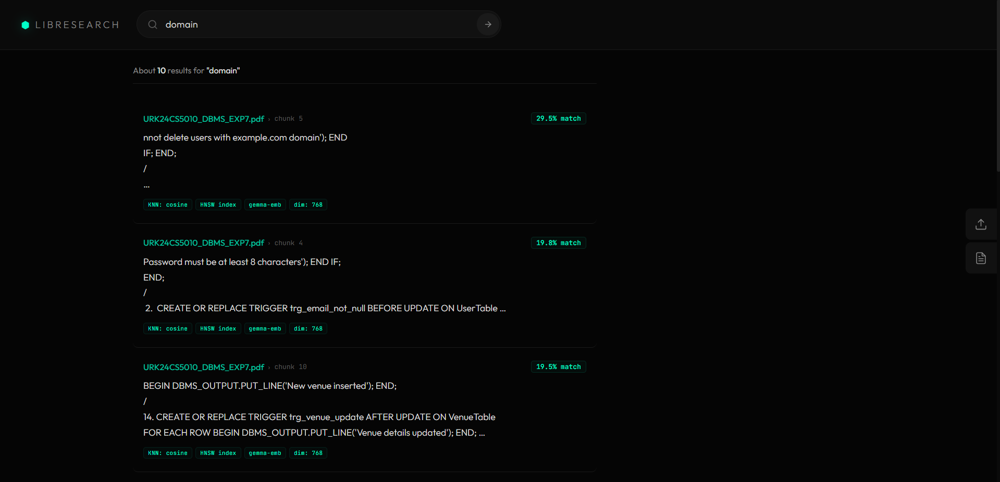
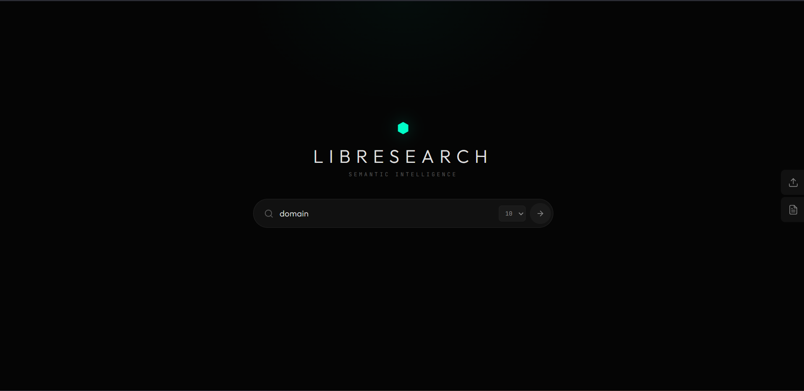

# LibreSearch

A semantic search engine built for Karunya University internals. Upload any document, and search through it using natural language queries powered by Google's Gemma Embedding model.




## Stack

- **Embedding Model**: Google EmbeddingGemma 300M (768-dim, runs locally)
- **Vector Database**: SurrealDB with HNSW index + cosine similarity
- **Backend**: Python / FastAPI
- **Frontend**: Svelte 5 / Vite

## Quick Start

### Prerequisites

- Python 3.10+
- Node.js 18+
- Docker
- [just](https://github.com/casey/just) (optional, for convenience commands)
- HuggingFace account with access to [google/embeddinggemma-300m](https://huggingface.co/google/embeddinggemma-300m)

### Setup

```bash
# Clone
git clone https://github.com/kakarot-dev/libre-search.git
cd libre-search

# Copy env
cp .env.example .env

# Install everything
just install
# or manually:
python3 -m venv venv
./venv/bin/pip install -r backend/requirements.txt
cd frontend && npm install && cd ..

# Login to HuggingFace (required for Gemma model)
./venv/bin/huggingface-cli login
```

### Run

```bash
# Start all services (SurrealDB + backend + frontend)
just up

# Or individually:
just db        # Start SurrealDB
just backend   # Start backend on :8081
just frontend  # Start frontend on :5173
```

Open [http://localhost:5173](http://localhost:5173) in your browser.

### Usage

1. Click the **Upload** icon (right sidebar) to ingest documents (PDF, DOCX, TXT, etc.)
2. Type a query in the search bar — results ranked by cosine similarity
3. Click a result card to view the full document with the matching chunk highlighted

## Project Structure

```
.
├── backend/
│   ├── main.py              # FastAPI app with lifespan
│   ├── config.py            # Settings from .env
│   ├── routers/
│   │   ├── ingest.py        # Upload + document CRUD endpoints
│   │   └── search.py        # Semantic search endpoint
│   ├── services/
│   │   ├── embedding.py     # Gemma embedding wrapper
│   │   ├── database.py      # SurrealDB async client
│   │   ├── parser.py        # PDF/DOCX/TXT parsing
│   │   └── chunker.py       # Text chunking with overlap
│   └── models/
│       └── schemas.py       # Pydantic models
├── frontend/
│   └── src/
│       ├── App.svelte       # Main app (Google-style layout)
│       ├── components/       # SearchBar, ResultCard, DocViewer, etc.
│       └── lib/api.js       # Backend API client
├── docker-compose.yml        # SurrealDB container
├── justfile                  # Task runner commands
└── .env.example
```

## API Endpoints

| Method | Path | Description |
|--------|------|-------------|
| POST | `/api/ingest` | Upload and ingest a document |
| POST | `/api/search` | Semantic search `{query, top_k}` |
| GET | `/api/documents` | List all documents |
| GET | `/api/documents/{id}/chunks` | Get all chunks for a document |
| DELETE | `/api/documents/{id}` | Delete a document |

## Useful Commands

| Command | Description |
|---------|-------------|
| `just up` | Start all services |
| `just down` | Stop all services |
| `just status` | Check what's running |
| `just reset-db` | Wipe and recreate the database |
